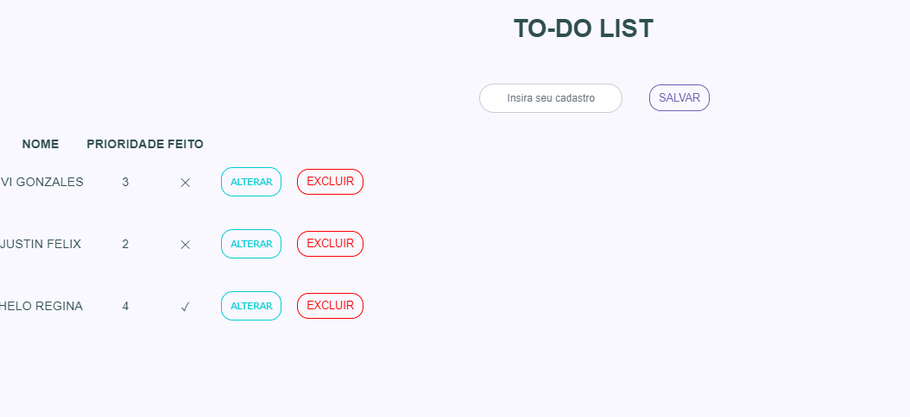

## Sobre o projeto:
 
 To-do list projeto com base em seleção para estágio, onde exige:

- Cadatrar;
- Alterar 
- Deletar


### Como funciona?

<h1 align="center">
    
</h1>


## Para obter projeto

```
$ git clone https://github.com/jucelania/todo-list-angular.git
$ cd todo-list
$ npm install 
//run the app
$ ng serve 
```
## Para executar 

Instale o Angular Cli em sua máquina:

````
$ npm install -g @angular/cli
$  ng version
````
Execute `ng serve --open` para um servidor de desenvolvimento. Navegue até `http://localhost:4200/`. O aplicativo será recarregado automaticamente se você alterar qualquer um dos arquivos de origem.

### 📝 Licença

Este projeto foi gerado com [ Angular CLI ] (https://github.com/angular/angular-cli) versão 1.2.7.


